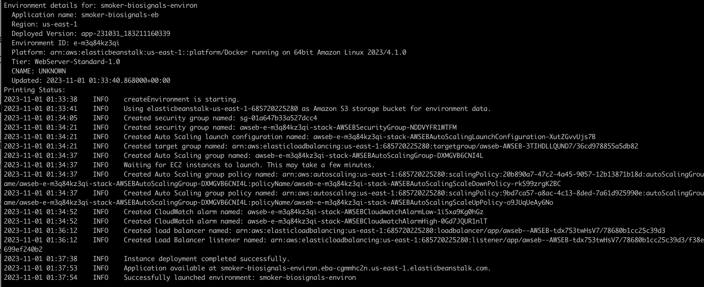
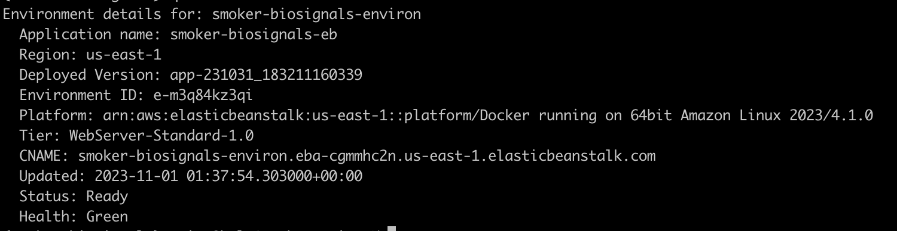

# Smoker Biosignals

Smoking has been proven to negatively affect health in a multitude of ways. Smoking has been found to harm nearly every organ of the body, cause many diseases, as well as reducing the life expectancy of smokers in general. As of 2018, smoking has been considered the leading cause of preventable morbidity and mortality in the world, continuing to plague the world’s overall health.

 Using the Kaggle dataset [Smoker Status Prediction using Bio-Signals](https://www.kaggle.com/datasets/gauravduttakiit/smoker-status-prediction-using-biosignals) my goal is to use ML to better predict smoking status. A group of scientists are working on predictive models with smoking status as the prediction target. My task is to help them create a machine learning model to identify the smoking status of an individual using bio-signals

This project includes an exploratory data analysis, feature engineering and classification models wih hyperparameter tuning, training code, python requirements, containerized fastapi for deployment.

## Dataset Description
- **age** : 5-year gap
- **height (cm)**
- **weight (kg)**
- **waist (cm)** : Waist circumference length
- **eyesight (left)**
- **eyesight (right)**
- **hearing (left)**
- **hearing (right)**
- **systolic** : Blood pressure
- **relaxation** : Blood pressure
- **fasting blood sugar**
- **Cholesterol** : total
- **triglyceride**
- **HDL** : cholesterol type
- **LDL** : cholesterol type
- **hemoglobin**
- **Urine protein**
- **serum creatinine**
- **AST** : glutamic oxaloacetic transaminase type
- **ALT** : glutamic oxaloacetic transaminase type
- **Gtp** : γ-GTP
- **dental caries**
- **smoking**

# EDA
[EDA and Baseline](baseline.ipynb)

During the EDA I evaluated if there were missing values, which features were numerical or categorical and the feature and target distributions. I also reviewed outliers and correlation of the features with themselves and the target. I found a high positive correlation with hemoglobin, height, weight, triglyceride, waist, serum creatine to the target smoking and a negative correlation to HDL and age. I also performed feature engineering and reviewed feature importance. With further research on the subject there appeared to be a general concensus that smokers are observed to have higher hemoglobin which was confirmed with the analysis.

# Feature Engineering
Based on the initial analysis I decided to evaluate features for weight/waist ratio, HDL/LDL ratio, I also tried some other ratios which I commented out in [EDA and Baseline](baseline.ipynb). I tried to create a health score with weighting some of the popular features. I only saw model improvement with HDL/LDL ratio but the other options could be useful for review to improve the models further.

# Model training
For this classification problem the following models were tested and tuned. [EDA and Baseline](baseline.ipynb)
| Model               | ROC Baseline | w/ FE and tuning |
|---------------------|--------------|------------------|
| Logistic Regression | 0.8074       |   N/A            |
| Decision Tree       | 0.7253       |   N/A            |
| Random Forest       | 0.8868       | 0.8907           |
| XGBoost             | 0.8479       | 0.8836           |

Random Forest looks like a great option.

# Training script
Using the MakeFile the training script can be invoked. The training script is using the best parameters found during the tuning.
```bash
make run_train
```

Note I included zlib compression to reduce the size of the model which could take a few moments depending on available CPU. Also due to the size of the model I didn't include the model in the repo.
# Reproducibility
Clone the repo 
```bash
git clone https://github.com/quinnavila/smoker_biosignals.git
```

The notebook [EDA and Baseline](baseline.ipynb) can be run after installing the corresponding requirements.
```bash
pip install -r requirements.txt
```

The dataset can be found here [Dataset](data/train_dataset.csv). And the original datset can be found here [Smoker Status Prediction using Bio-Signals](https://www.kaggle.com/datasets/gauravduttakiit/smoker-status-prediction-using-biosignals)

The dataset can be downloaded with the notebook code like this.
```bash
df = pd.read_csv("data/train_dataset.csv")
```

The baseline notebook and train.py can all be run after the dependencies loaded. 

# Model Deployment

NOTE: Due to the size of the model. I didn't include the model in the repo. After make run_train the model from models/random_forest_model.pkl needs to be copied to web_service/app/random_forest_model.pkl for the Fastapi app to use. Also saving the model is using commpression so may take a few moments depending on CPU.

The model has been deployed and containerized with FastAPI. The code [FastAPI code](web_service/app/predict.py)

This can also be tested using the Makefile
```bash
make test_server

# which is
uvicorn app.predict:app --reload --app-dir web_service --port 9696
```

In a new window execute using make or the following curl command. row_data.json is a sample json file with test data. 
```bash
make test_client

# Corresponding curl command
curl -X POST -d @row_data.json -H "Content-Type: application/json" http://localhost:9696/predict
```
NOTE: row_data.json is sample data to test with. 

# Dependency and environment management
For dependency management a requirements file can be installed. The project was tested with python 3.9 and 3.11.

For example using pyenv
```bash
pyenv virtualenv 3.9.17 smoker_biosignals

pyenv activate smoker_biosignals
```
Or using your favorite dependency management system

The project has a requirements.txt and can be used for example
```bash
pip install -r requirements.txt
```

# Containerization
The FastAPI application has been dockerized using this [Dockerfile](web_service/Dockerfile)

This can be tested with the following Makefile commands for builing and running

```bash
make docker_build

# Which is
docker build -t smoker_biosignals:v1 -f web_service/Dockerfile .
```

```bash
make docker_run

# Which is
docker run -p 9696:9696 smoker_biosignals:v1
```

This can then be tested with the makefile
```bash
make test_client
```

# Cloud deployment
With the application containerized we can deploy to the cloud. Here are the commands with elastic beanstalk cli. I also created a route /healthcheck for the target group to use.

NOTE: This needs to be run from the web_service directory and the Dockerfile changed slightly to accomodate eb cli.
```bash
eb init -p docker -r us-east-1 smoker-biosignals

eb local run --port 9696

eb create smoker-biosignals-env
```







NOTE: Need to review default eb ports. During testing I manually changed the target group ports to match the application.